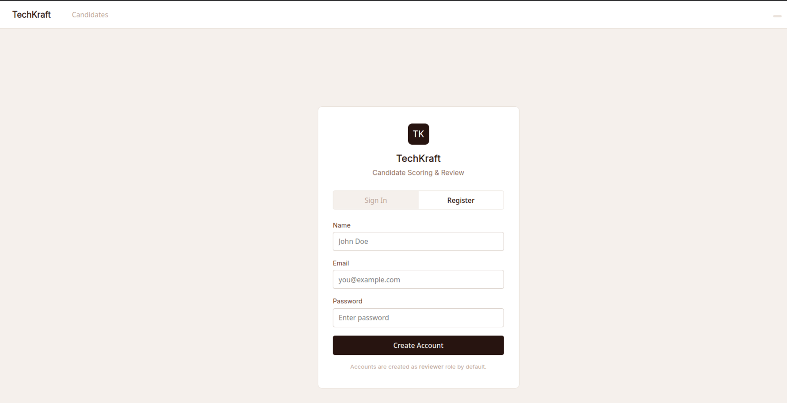
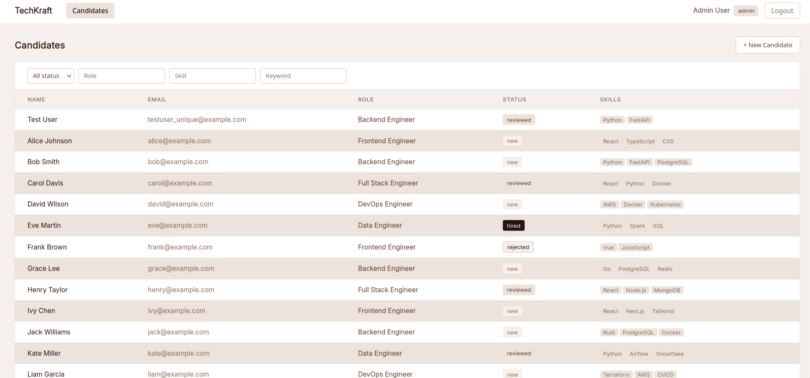
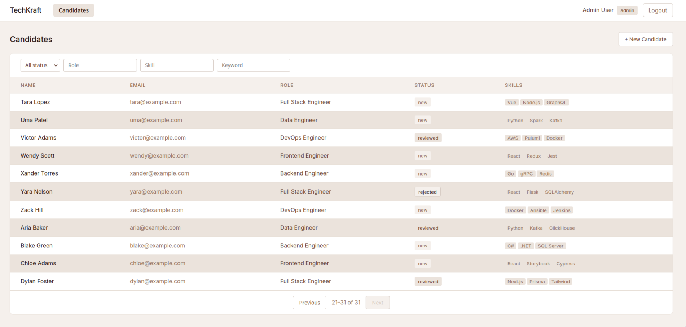
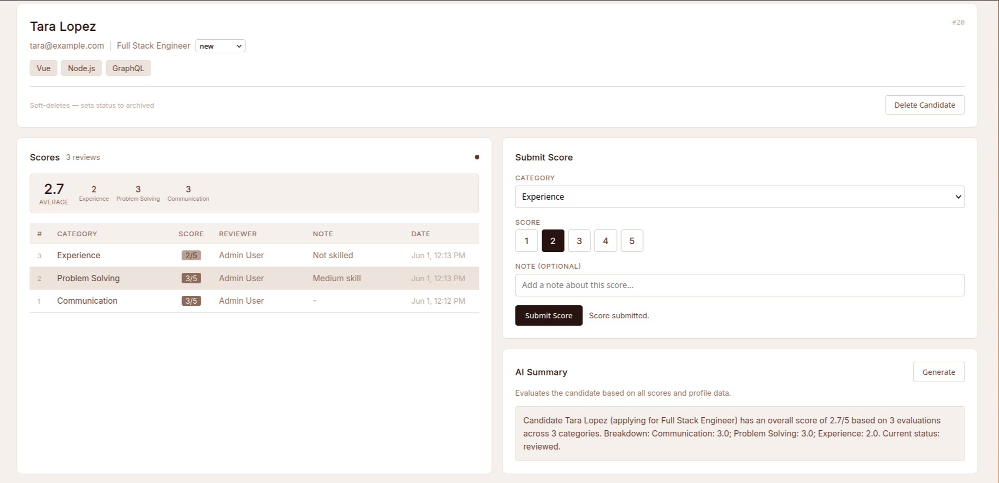

# TechKraft Candidate Scoring & Review Dashboard

**Company:** TechKraft Inc.
**Position:** Full Stack Engineer (Mid)

An internal candidate scoring and review dashboard for TechKraft's recruitment workflow that includes admin UIs, scoring systems, and AI-assisted review interfaces. It is built with **FastAPI** (Python), **React + Vite**, **SQLite**, and **Docker Compose**.

---

## Quick Start

### Run with Docker Compose (recommended)

```bash
# 1. Clone the repo and enter the directory
git clone https://github.com/icarus-20s/Candidate-Scoring-Review-Dashboard.git
cd Candidate-Scoring-Review-Dashboard

# 2. Create .env from the template
cp .env.example .env

# 3. Build and start all services
docker compose up --build
```

Once running, open:

| Service    | URL                          |
| ---------- | ---------------------------- |
| Frontend   | http://localhost:5173        |
| Backend API| http://localhost:8000        |
| API Docs   | http://localhost:8000/docs   |

### Default Credentials

| Role     | Email                 | Password  |
| -------- | --------------------- | --------- |
| Admin    | admin@techkraft.com   | admin123  |

New users can be registered through the UI, but all registrations are hardcoded to the `reviewer` role regardless of client input.

### Local Development (no Docker)

#### Backend Setup

```bash
cd backend
python3 -m venv .venv
source .venv/bin/activate       # Windows: .venv\Scripts\activate
pip install -r requirements.txt
cp .env.example .env            # or set JWT_SECRET yourself
uvicorn app.main:app --reload --host 0.0.0.0 --port 8000
```

#### Frontend Setup

```bash
cd frontend
npm install
npm run dev
```

The `VITE_API_URL` env var controls where the frontend proxy sends API requests. Default is `http://localhost:8000`.

### Environment Variables

The only required environment variable is `JWT_SECRET`:

```bash
# .env  (copy from .env.example)
JWT_SECRET=your-random-secret-here
```

| Variable      | Required | Default                    | Description                          |
| ------------- | -------- | -------------------------- | ------------------------------------ |
| `JWT_SECRET`  | Yes      | `dev-secret-change-in-prod`| Secret key used to sign JWT tokens   |

For Docker, create a `.env` file in the project root and `docker compose` will load it automatically. For local dev, copy `backend/.env.example` to `backend/.env`.

---

## Screenshots

| Login | Candidate List |
|-------|---------------|
|  |  |

| Candidate Detail | AI Summary |
|-----------------|------------|
|  |  |

---

## Problem Statement

TechKraft's recruitment team needs a web-based tool to manage candidate assessments. Reviewers need to score candidates across categories and view AI-generated summaries. Admins need full visibility.

---

## Core Requirements

### 1. Backend API (FastAPI)

| Method | Path                          | Auth   | Description                                |
| ------ | ----------------------------- | ------ | ------------------------------------------ |
| POST   | `/auth/register`              | None   | Register (always creates `reviewer` role)  |
| POST   | `/auth/login`                 | None   | Login, returns JWT                         |
| GET    | `/auth/me`                    | JWT    | Current user info                          |
| GET    | `/candidates`                 | JWT    | List with filters + pagination             |
| POST   | `/candidates`                 | JWT    | Create candidate                           |
| GET    | `/candidates/{id}`            | JWT    | Candidate detail with scores + AI summary  |
| PATCH  | `/candidates/{id}`            | Admin  | Update status or internal_notes            |
| DELETE | `/candidates/{id}`            | Admin  | Soft-delete (sets status to `archived`)    |
| POST   | `/candidates/{id}/scores`     | JWT    | Submit score (1–5, category, optional note)|
| GET    | `/candidates/{id}/scores`     | JWT    | Reviewer sees own; admin sees all          |
| POST   | `/candidates/{id}/summary`    | JWT    | Trigger mock AI summary (2s delay)         |
| GET    | `/candidates/{id}/stream`     | JWT    | SSE stream of score updates (stretch goal) |

**Pagination:** Offset-based with configurable page size (default 20, max 50). Response includes `items`, `total`, `page`, `page_size`, and `next_offset` (null when last page).

### 2. Database (SQLite)

**candidates:** `id`, `name`, `email`, `role_applied`, `status` (new/reviewed/hired/rejected), `skills` (JSON array), `internal_notes` (admin-only), `ai_summary`, `created_at`

**scores:** `id`, `candidate_id`, `category`, `score` (1–5), `reviewer_id`, `note`, `created_at`

**Indexes:** `candidates.status`, `candidates.role_applied`, `scores.candidate_id`, `scores.reviewer_id`

### 3. Role-Based Access Control

- **JWT-based authentication** with email + password
- **Reviewer role:** Can score candidates, sees only their own scores, cannot view `internal_notes`
- **Admin role:** Can see all scores from all reviewers, can view and edit `internal_notes`, can change candidate status
- **Registration always assigns `role="reviewer"`** and never accepts a role value from the client, preventing privilege escalation by design

### 4. Frontend (React + Vite)

- **Login page** with sign-in / register toggle
- **Candidate list page** with filter controls (`status`, `role_applied`, `skill`, `keyword`) and offset-based pagination
- **Candidate detail page** showing:
  - Profile info with skills and status badge
  - Scores table (reviewer sees own scores; admin sees all)
  - Submit score form (category select + score 1–5 + note)
  - AI summary section (trigger button with loading state, displays result)
  - Stats summary bar (average + per-category breakdown)
  - Real-time SSE updates with connection indicator and "updated" flash
- **Admin-only internal notes panel** with inline editing

### 5. Containerization (Docker Compose)

```yaml
services:
  backend:   # FastAPI on port 8000 (Python 3.12-slim)
  frontend:  # Multi-stage: Node build to nginx static on port 5173
```

- Production multi-stage build (frontend served via nginx, not Vite dev server)
- Healthcheck on backend (`GET /health`)
- `restart: unless-stopped` for production resilience
- Nginx reverse-proxies `/api/` to `backend:8000`, keeping requests same-origin and avoiding CORS issues entirely
- Persistent volume for SQLite database

### 6. Testing

```bash
cd backend
pip install -r requirements.txt
pytest tests/ -v
```

**14 tests covering:**
- Creating a candidate and verifying the response
- Reviewer 1 cannot see Reviewer 2's scores
- Reviewer cannot see `internal_notes` (list + detail)
- Soft-deleted candidate returns 404 on GET (detail)
- AI summary endpoint returns content and persists to `ai_summary`
- Auto status progression from `new` to `reviewed` on the first score submission
- Admin can change status (PATCH `hired` / `rejected`)
- Reviewer cannot change status (403)
- Reviewer cannot edit `internal_notes` (403)
- Pagination behavior (`page_size`, `offset`, `next_offset`)
- Page size capped at 50 (422 beyond)
- Non-admin cannot delete (403)
- Soft-deleted candidate excluded from list

---

## Debugging Signal

The following query pattern from a hypothetical service layer has a subtle bug:

```python
def search_candidates(status: str, keyword: str, page: int, page_size: int):
    all_candidates = db.execute("SELECT * FROM candidates").fetchall()
    filtered = [c for c in all_candidates if c["status"] == status]
    # ... also filter by keyword in Python ...
    offset = (page - 1) * page_size
    return filtered[offset : offset + page_size]
```

**The bug:** This loads the **entire** `candidates` table into application memory and then filters and paginates in Python.

**Why it matters at scale:** With thousands or millions of rows, this pattern saturates application memory (OOM risk), wastes network I/O transferring unused rows, makes pagination meaningless since each page re-reads every row, and prevents the database from using indexes for filtering or sorting.

**Correct approach:** Push filtering and pagination to the database via SQL `WHERE` clauses, `LIMIT`, and `OFFSET`. Use proper indexes on filtered columns (`status`, `role_applied`) to keep queries efficient regardless of table size.

---

## Architecture Decision Record (ADR)

### ADR 1: FastAPI over Flask or Django REST

- **Context:** Need async support for mock AI summary (2s sleep) and SSE streaming, plus clear Pydantic integration for request validation.
- **Decision:** FastAPI with async endpoints and aiosqlite for non-blocking DB access.
- **Trade-off:** FastAPI has a smaller ecosystem than Django, but for an internal tool of this scope the performance and developer experience gains outweigh the difference.

### ADR 2: SQLite over PostgreSQL / DynamoDB

- **Context:** The spec allowed DynamoDB-style or SQLite. This is a local/internal tool without high concurrency requirements.
- **Decision:** SQLite with aiosqlite async driver, WAL mode, and explicit indexes on `status`, `role_applied`, and `candidate_id`.
- **Trade-off:** SQLite doesn't support concurrent writes at scale. For a multi-server deployment, we'd migrate to PostgreSQL. For this take-home, SQLite keeps the setup zero-config while still demonstrating proper indexing and schema design.

### ADR 3: JWT with Hardcoded Reviewer Role on Registration

- **Context:** Role-based access control is required such that reviewers see only their own scores while admins have full visibility, and registration must never accept a role value from the client.
- **Decision:** JWTs carry `id`, `email`, `role`, and `name`; the register endpoint hardcodes `role="reviewer"`; an admin user is created via a seed script rather than an endpoint; and auth middleware decodes the JWT on every request.
- **Trade-off:** JWTs are stateless and simple but lack a token revocation mechanism. For a production system we would add token blacklisting or switch to session-based auth, though the hardcoded role at registration prevents privilege escalation by design.

### ADR 4: SSE over WebSockets

- **Context:** Real-time score updates are needed where the broadcast is unidirectional from server to client and traffic is low.
- **Decision:** SSE via `sse-starlette` with a 2s polling loop. The frontend uses the browser-native `EventSource` API.
- **Trade-off:** SSE is simpler than WebSockets and works through HTTP/1.1 proxies, but it's unidirectional and the server has no way to know if the client disconnected without a timeout. `EventSource` also cannot set custom headers, so JWT is passed as a `?token=` query parameter.

---

## Learning Reflection

Building the SSE (Server-Sent Events) endpoint with FastAPI and `sse-starlette` deepened my understanding of real-time server-to-client communication patterns. SSE proved well-suited for the score-update use case because it is unidirectional, works over standard HTTP, and the browser-native `EventSource` API keeps the frontend integration simple without third-party dependencies.

A key takeaway was the JWT authentication workaround: since `EventSource` cannot set custom HTTP headers, the token must be passed as a `?token=` query parameter. This is a well-known limitation that trades header-based security for SSE compatibility, and in practice it is acceptable when the connection uses HTTPS.

Given more time, I would explore WebSocket-based updates instead. WebSockets provide bidirectional communication that would allow the client to acknowledge disconnection and let the server clean up stale event generators, which is an edge case the current polling-based SSE approach does not handle gracefully.
